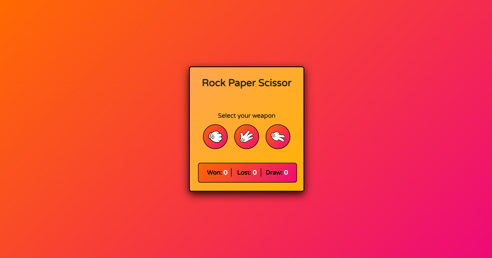
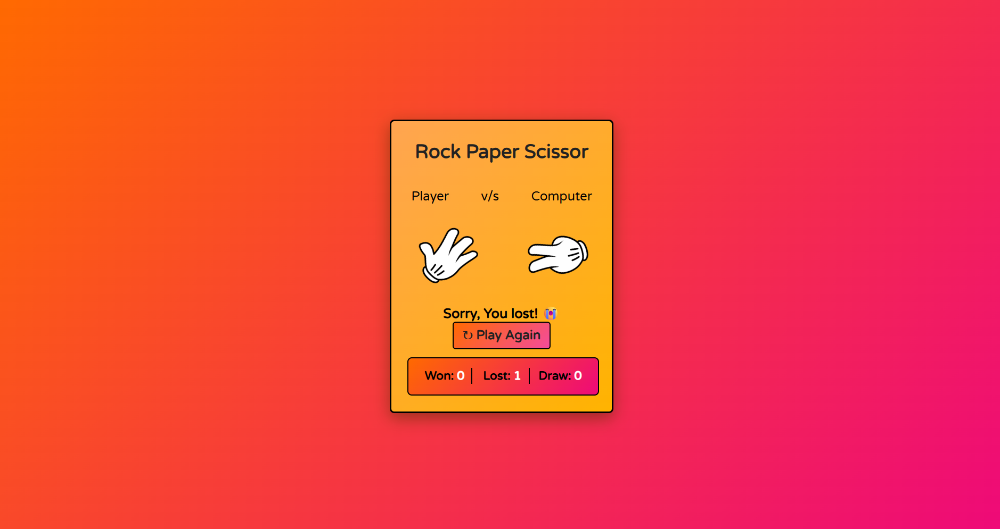

# Rock Paper Scissors 🎮

A classic **Rock Paper Scissors** game built using **HTML**, **CSS**, and **JavaScript**. Play against the computer, track your score, and enjoy smooth animations — all in a responsive UI!

## 📸 Preview

 
 

## 🔧 Features

- 👊 Rock, ✋ Paper, ✌️ Scissors gameplay
- 🤖 Computer generates random choices
- 📈 Live score tracking (Wins / Losses / Draws)
- 🎨 Smooth hover & click animations
- 📱 Fully responsive design

## 📂 Technologies Used

- **HTML5** – Page structure
- **CSS3** – Styling and animations
- **JavaScript (Vanilla)** – Game logic and interactivity

## 🧠 What I Learned

- DOM manipulation and event handling  
- Using conditionals to handle logic  
- Responsive design with media queries  
- Building UI/UX through animations  

## 🙌 Contribute

Found a bug or have an idea to improve the game?  
Feel free to **fork this repo**, make your changes, and **submit a pull request**!

## 📬 Contact

Connect with me on [LinkedIn](https://www.linkedin.com/in/sumeetpandey9)

## 🚀 How to Run Locally

```bash
git clone https://github.com/sumeetpandey9/Rock-Paper-Scissor-Game.git
cd rock-paper-scissors
open index.html 
